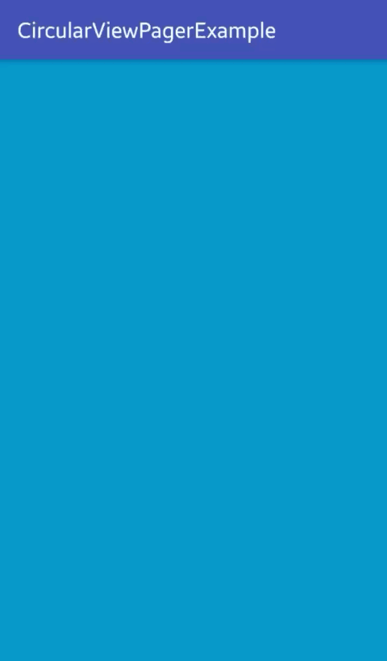
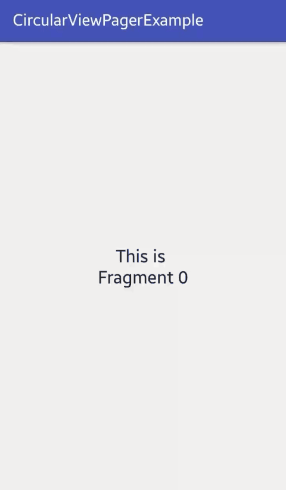

# CircularViewPager

An infinitely scrollable viewpager for android.
<br>



## Features
- Supports static layout
- Supports fragments


## Getting started
In your build.gradle:

```
repositories {
    maven {
        url  "http://dl.bintray.com/tompee26/Android" 
    }
}

dependencies {
   compile 'com.tompee:circular-viewpager:1.0.0'
}
```

Define `CircularViewPager` in xml layout with pageCount attribute
``` xml
<com.tompee.circularviewpager.CircularViewPager
    android:id="@+id/view_pager"
    android:layout_width="match_parent"
    android:layout_height="match_parent"
    app:pageCount="2"/>
```

Create a `CircularViewPager` instance
```java
CircularViewPager viewPager = (CircularViewPager) findViewById(R.id.viewpager);
```

Setup with static layout pages
```java
circularViewPager.setLayoutPagerAdapter(new CircularViewPager.GetLayoutItemListener() {
    @Override
    public int getLayout(int position) {
        // return layout ID
    }
});
```

Or setup with fragments
```java
circularViewPager.setFragmentPagerAdapter(getSupportFragmentManager(),
        new CircularViewPager.GetFragmentItemListener() {
            @Override
            public Fragment getFragment(int position) {
                // Always return a new fragment instance
                // to workaround the fragment already added issue of FragmentPagerAdapter
            }
        });
```

## Thanks
This library is an extension of lib4's CircularViewPager
https://github.com/lib4/CircularViewPager/tree/master/src/com/lib4/circularviewpager

## License
```
MIT License

Copyright (c) 2017 tompee

Permission is hereby granted, free of charge, to any person obtaining a copy
of this software and associated documentation files (the "Software"), to deal
in the Software without restriction, including without limitation the rights
to use, copy, modify, merge, publish, distribute, sublicense, and/or sell
copies of the Software, and to permit persons to whom the Software is
furnished to do so, subject to the following conditions:

The above copyright notice and this permission notice shall be included in all
copies or substantial portions of the Software.

THE SOFTWARE IS PROVIDED "AS IS", WITHOUT WARRANTY OF ANY KIND, EXPRESS OR
IMPLIED, INCLUDING BUT NOT LIMITED TO THE WARRANTIES OF MERCHANTABILITY,
FITNESS FOR A PARTICULAR PURPOSE AND NONINFRINGEMENT. IN NO EVENT SHALL THE
AUTHORS OR COPYRIGHT HOLDERS BE LIABLE FOR ANY CLAIM, DAMAGES OR OTHER
LIABILITY, WHETHER IN AN ACTION OF CONTRACT, TORT OR OTHERWISE, ARISING FROM,
OUT OF OR IN CONNECTION WITH THE SOFTWARE OR THE USE OR OTHER DEALINGS IN THE
SOFTWARE.
```
